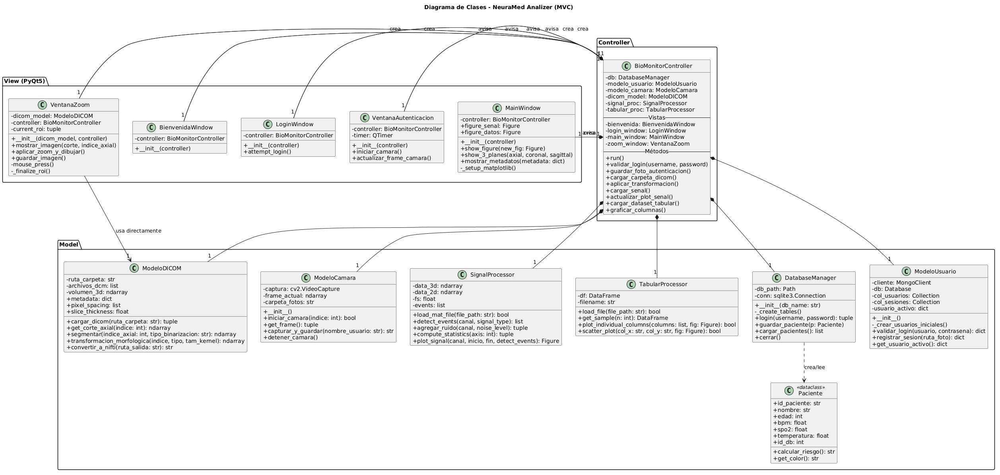

# 🧬 NeuraMed Analizer - Sistema Integrado de Análisis Biomédico


**NeuraMed Analizer** es una aplicación de escritorio avanzada desarrollada bajo el patrón de arquitectura **Modelo-Vista-Controlador (MVC)**. Está diseñada para la carga, procesamiento, análisis y visualización de tres tipos de datos biomédicos fundamentales: imágenes médicas, señales fisiológicas y datos clínicos tabulares.

Este proyecto fue desarrollado como entrega final para la asignatura **Informática II** del programa de **Bioingeniería** de la **Universidad de Antioquia (UdeA) - Semestre 2026-1**.

Autores: 
- Elianis Navarro.
- Samuel Bustamante.
- Tomás Becerra.
Fecha: Junio 2026

---

## ✨ Características Principales

### 🔐 Autenticación y Seguridad
* **Login Multi-Base de Datos:** Validación de credenciales de forma local (SQLite) y sincronizada en la nube (MongoDB Atlas).
* **Verificación Biométrica Simula:** Uso de OpenCV para activar la webcam, capturar una fotografía del usuario en la sesión y guardar el registro fotográfico con timestamp.

### 🧠 Módulo de Imágenes Médicas (DICOM)
* **Reconstrucción 3D y Multi-planar:** Visualización interactiva con sliders de los cortes Axial, Coronal y Sagital de volúmenes DICOM.
* **Conversión a Unidades Hounsfield (HU):** Transformación automática para tomografías computarizadas (CT) usando `RescaleSlope` y `RescaleIntercept`.
* **Herramientas de Procesamiento:** * Zoom interactivo y selección de Región de Interés (ROI) con el mouse.
  * Segmentación mediante múltiples filtros de binarización (Truncado, Tozero, Binario Invertido).
  * Transformaciones morfológicas ajustables (Erosión, Dilatación, Apertura, Cierre) mediante kernels variables.
* **Exportación:** Conversión de volúmenes completos DICOM al estándar NIfTI (`.nii.gz`).

### 📈 Módulo de Señales Fisiológicas (ECG/EMG)
* **Lectura de Archivos `.mat`:** Carga dinámica de matrices de señales, extrayendo frecuencia de muestreo y aislando canales.
* **Procesamiento de Señal:**
  * Detección de picos/eventos y selección de rangos de muestras específicos.
  * Inyección controlada de ruido gaussiano para evaluar robustez.
  * Extracción de estadísticas univariadas (Media, Desviación Estándar, Mínimo, Máximo) con visualización de *stem plots*.

### 📊 Módulo de Datos Tabulares
* **Análisis Exploratorio:** Carga de datos clínicos desde formatos CSV o Excel usando pandas.
* **Visualización Inteligente:** * Generación de *Scatter Plots* para análisis bivariado incluyendo líneas de tendencia de regresión lineal.
  * Histogramas y gráficos de barras consolidados directamente en los *canvas* integrados de la interfaz.
* **Estadísticas Automáticas:** Reportes en tablas interactivas de las funciones `describe()` e `info()`.

---

## 📐 Arquitectura del Sistema (MVC)

El código implementa un estricto desacoplamiento para asegurar la mantenibilidad y escalabilidad del sistema:
* **Modelo (`model/`):** Contiene la lógica de negocio pura, algoritmos matemáticos, procesamiento con NumPy/SciPy/Pandas y la conexión a las bases de datos (SQLite/MongoDB).
* **Vista (`view/`):** Interfaces gráficas (archivos `.ui` compilados en tiempo de ejecución) construidas íntegramente en **Qt Designer** y manejadas mediante `PyQt5`.
* **Controlador (`controller/`):** Orquesta el flujo de información, recibe eventos del usuario desde la vista y actualiza el modelo en consecuencia.

### Diagrama de Clases UML
A continuación se ilustra la interacción entre los componentes del sistema:



---

## 📂 Estructura del Directorio

```text
.
├── Manual_Usuario_Modulos.pdf       # Guía paso a paso de uso
├── UML.puml
├── UML_Lucidchart.png               # Diagrama UML versión LucidChart
├── UML_PlantUML.png                 # Diagrama UML versión Plant UML
├── README.md                        # Documentación del proyecto
├── controller/
│   └── controller.py                # Controlador central MVC
├── data/                            # Datasets y archivos médicos de prueba
│   ├── clinical_data.csv
│   ├── ecg_sano.mat
│   ├── imagen_resonancia.nii.gz
│   └── volumen_dicom.nii.gz
├── database/
│   └── biomonitor.db                # Base de datos local SQLite
├── fotos_sesion/                    # Capturas fotográficas del inicio de sesión
├── main.py                          # Punto de entrada de la aplicación
├── model/
│   ├── database.py                  # Conexión SQLite
│   ├── modelo_camara.py             # Integración con OpenCV
│   ├── modelo_dicom.py              # Lógica Pydicom/Nibabel
│   ├── modelo_usuario.py            # Conexión MongoDB Atlas
│   ├── paciente.py                  # Entidad Paciente (Dataclass)
│   ├── signal_processor.py          # Lógica SciPy para señales
│   └── tabular_processor.py         # Lógica Pandas para datasets
├── pyproject.toml                   # Configuración del gestor uv
├── requirements.txt                 # Dependencias clásicas
├── uv.lock                          # Archivo de bloqueo de versiones de uv
└── view/
    ├── ventana_autenticador.ui
    ├── ventana_bienvenida.ui
    ├── ventana_login.ui
    ├── ventana_principal.ui
    ├── ventana_zoom.ui
    └── views.py                     # Gestión de eventos de PyQt5
```
## ⚙️ Instalación y Ejecución

Puedes levantar este proyecto utilizando **`uv`** (recomendado por su extremada rapidez en la gestión de entornos) o mediante el entorno tradicional de **Anaconda**.

### Requisitos Previos
* **Python 3.12+**
* Webcam funcional (requerida para el módulo de login biométrico).
* Conexión a internet (para sincronización con MongoDB Atlas).

### Opción 1: Usando `uv` (Recomendado)
Dado que el proyecto cuenta con los archivos `pyproject.toml` y `uv.lock`, la configuración del entorno es automática.

1. Instala `uv` en tu sistema (si no lo tienes):
```bash
   pip install uv
```
2. Sincroniza el entorno e instala las dependencias exactas definidas en el lockfile:
```bash
   uv sync
```
3. Ejecuta la aplicación utilizando el entorno virtual aislado que uv acaba de configurar:
```bash
   uv run main.pu
```


### Opción 2: Usando Anaconda (conda)
Si prefieres aislar tu entorno usando Conda y el archivo requirements.txt clásico:

1. Crea un nuevo entorno de conda especificando la versión de Python:
```bash
   conda create --name neuramed python=3.12 -y
```
2. Activa el entorno virtual recién creado:
```bash
   conda activate neuramed
```
3. Instala las dependencias necesarias leyendo el archivo de requerimientos:
```bash
   pip install -r requirements.txt
```
4. Inicia la aplicación:
```bash
   python main.py
```
